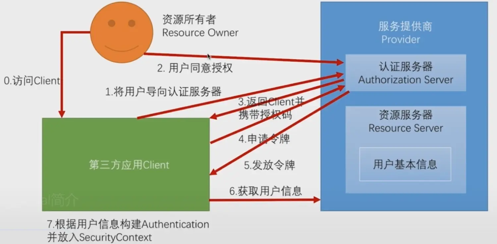

easy-security 基于过滤器实现的一款配合spring快速开发的安全认证框架，思想是希望通过简单的配置，并且实现核心的方法达到认证和鉴权的目的。

easy-security  **不限制存取token方式**，无论是保存到服务端还是使用JWT等都可以，因为这部分是由开发者自己来定义的，只需要告诉 easy-security 该如何获取用户信息即可。

如果你使用了 easy-security ，那么所有的接口请求均以POST方式，可以通过 Localutil.getUser() 获取用户，解耦开发者获取认证用户的。

## 功能介绍

* 认证拦截
* 权限校验
* 用户获取
* 黑名单
* 密文传输(内置AES加密算法)

## 关于OAuth

 

OAuth 是授权协议为用户资源的授权提供了一个安全的、开放而又简易的标准,他不是一个框架，所以很多人有疑惑说我们是否支持 OAuth，我想说当然！！OAuth 就是一个登录流程而已，总会获取到一个 Access_token。

如果有足够的耐心了解我们框架，你就会知道，获取到 Access_token 其实就和普通的登录应用获取到 token 是一样的，在我们框架不限制你对token做任何存取上的限制，你就算放到 Mysql 都行，写到服务器File文件都可以。

我们的核心始终是给开发者足够的自由，不是傻瓜式的调用一下就好，也不是非得等我们兼容什么Redis等缓存中间件才能给开发者用某个功能，在我们看来登录是很简单的功能，我们只为你进行认证和权限的拦截，并为微服务认证授权提供好支持。