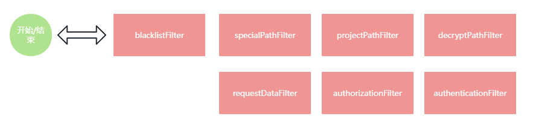
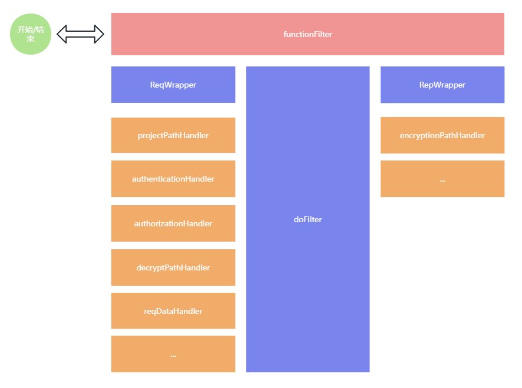

## 1.0.0 架构

这是 easy-security 1.0.0 的架构，是基于过滤器链的拦截机制实现的，过滤器可以对Request和Response的内容重写，请求头自由设置（在Controller或拦截器中设置很别扭），开发者发挥自由度更大，所以我们选择基于过滤器去处理所有的框架逻辑和数据。

我们按照链路，对每个逻辑的顺序都是指定好的，如果顺寻混乱很有可能造成数据处理错误，这也是过滤器所存在的问题，但无法避免，我们应该正视这样的问题。每一个过滤器都是单独的逻辑，像 blackListFilter 黑名单过滤器，顾名思义，只会拦截在黑名单的用户，黑名单用户访问就会被拒绝访问。

这样的设计存在一定的问题，当需要在添加一个逻辑的时候，难道我们还需要再去添加一个过滤器吗？不，显然这违背了扩展性原则，我们不可能在添加一个逻辑的时候又打包发布生一个小版本，所以一不做二不休，在短短的几天时间我们设计了 easy-security 2.0.0

## 2.0.0 架构

easy-security 2.0.0 吸取了 1.0.0 的设计经验，为提高扩展性进行了一定的架构改变。

首先，我们从多个过滤器变为了只需要一个过滤器（FuntionFilter 核心功能过滤器），做为框架功能核心的承载着。当请求经过这个过滤器，会按顺序执行每个 Handler。

Handler 就是 1.0.0 中的每个框架功能逻辑，我们把横向扩展的逻辑变为纵向扩展，这样不会使过滤器的链路变长，从而性能也会变得更好（因为过滤器类似栈一样，每执行一个都压入栈不会立即出栈，会有回栈的操作），我们把这种形式改为了像队列一样，每执行完一个逻辑立即结束，效率进行了提高。

Handler 我们设计是一个可扩展的，开发者可以定义自己的 Handler，只需要实现 ReqFunctionHandler（处理request请求） or RepFunctionHandler（处理Response请求）。但是注意 Handler 是有顺序的，就像我们写业务接口，先查库存，再下订单。

::: warning
框架内部的 Handler 是从 Interger.MaxValue or Interger.MinValue 进行设置的
:::

::: tip
不是所有架构设计好就是完美的，希望大家多多提意见，给与更好的设计想法。
:::

### 改变
自2.1.x 或 3.1.x之后，不在有`projectPathHandler,reqDataHandler`