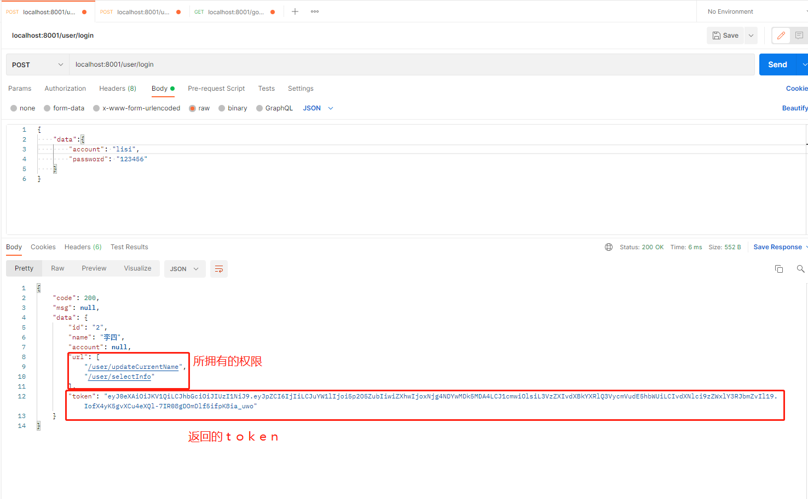
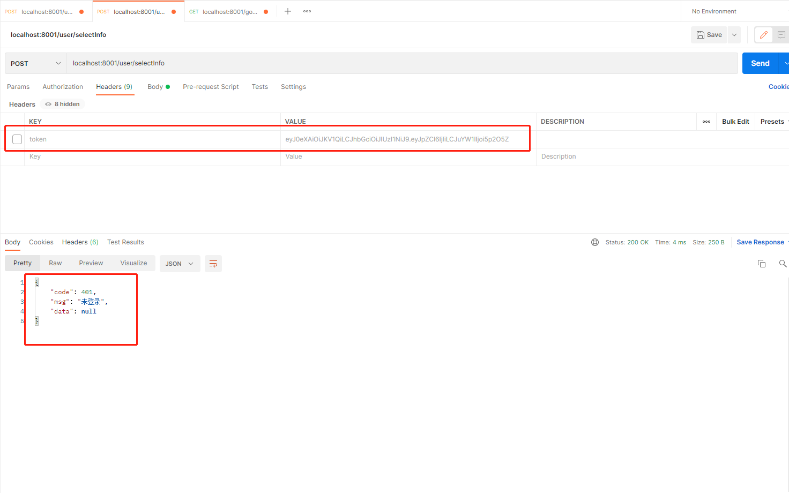
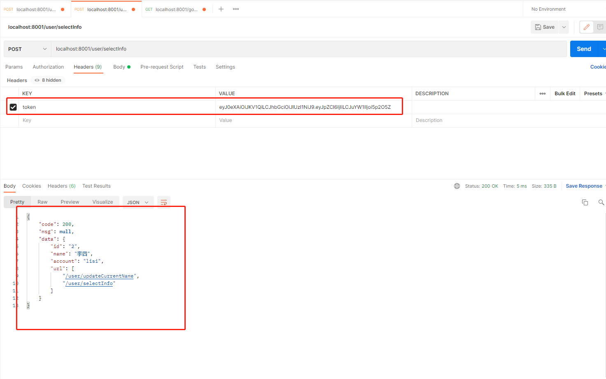
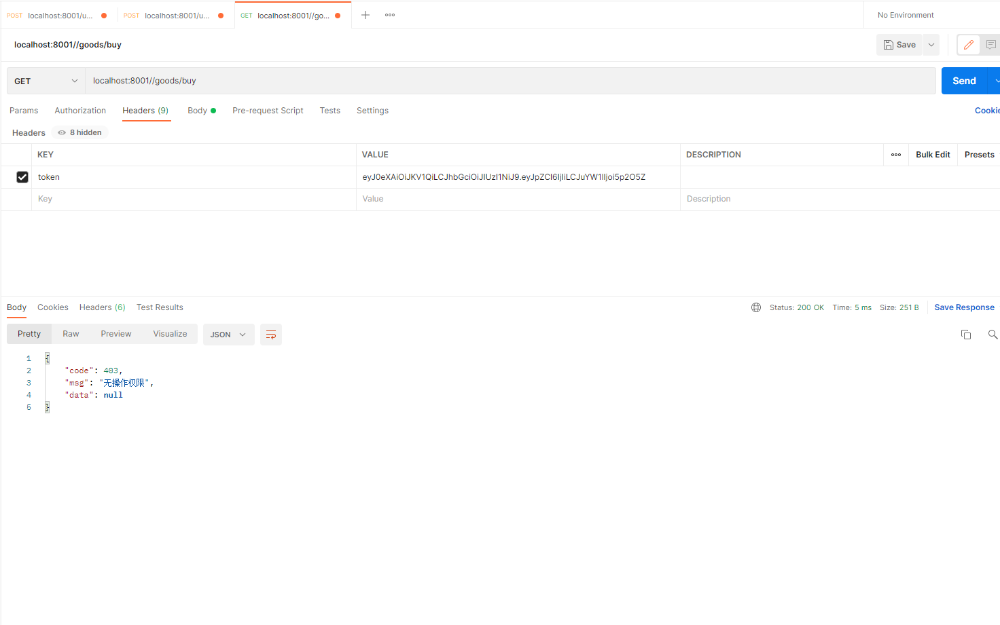
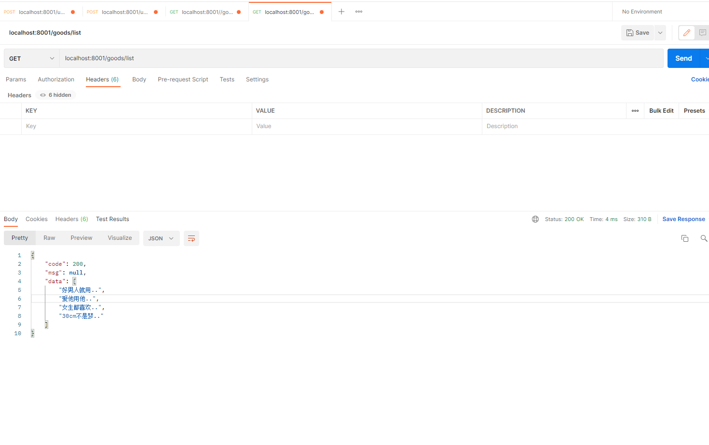

在单体架构的应用中，不需要考虑分布式，微服务，是一种最简单最便捷的开发，但单项目开发越大，则越难维护，但对于小型项目来说单体架构依然是开发首选。那么在单体架构的应用中，如何使用 easy-security 呢？

其实在快速开始的时候已经简单的演示过了，只需要添加依赖、配置、实现逻辑、开始使用即可，为了照顾大家更容易理解，我这里会写一个Demo，简单写几个测试用例，以及顺便详细讲下配置中属性的使用。

项目地址：<a href="https://gitee.com/landashu/east-security-demo.git">https://gitee.com/landashu/east-security-demo.git</a>
## 项目介绍
该 Demo 我给配置了 6 个接口，接口作用及描述如下：
```
/goods/list 查询商品列表，该接口一般不需要登录，用户可以直接查看
/goods/info 查询商品详情，该接口一般不需要登录，用户可以直接查看
/goods/buy 购买商品，购买需要用户登录之后才能购买
/user/login 用户登录接口
/user/updateCurrentName 用户修改自己的名称
/user/selectInfo 查询用户详情
```
为此我们还模拟了几个用户，以及用户所拥有的权限，具体如下：
```
List<UserEntity> db = Arrays.asList(
    new UserEntity("1","张三","zhangsan",Arrays.asList("/goods/buy","/user/updateCurrentName","/user/selectInfo")),
    new UserEntity("2","李四","lisi",Arrays.asList("/user/updateCurrentName","/user/selectInfo")),
    new UserEntity("3","王五","wangwu",Arrays.asList("/goods/buy","/user/selectInfo")),
    new UserEntity("4","赵六","zhaoliu",Arrays.asList("/goods/buy","/user/updateCurrentName")),
    new UserEntity("5","田七","tianqi",Arrays.asList("/goods/buy","/user/updateCurrentName","/user/selectInfo"))
);
```
其中 UserEntity 后面描述的就是该用户所拥有的权限

## 配置项目
先配置 yml,让我们开启认证和鉴权
```
server:
  port: 8001

easy:
  security:
    auth-enable: true # 开启认证
    authorize-enable: true # 开启鉴权
    request-data-enable: true # 开启Req
    project-url: # 放行/user/login 接口
      - /user/login
    special-url: # 特殊路径，当你 request-data-enable = true，有些接口又需要 get请求的时候，可以把接口配置在这里就不会拦截了，当然如果一个业务下的所有接口都不需要拦截 你可以使用 /业务/** 
      - /goods/list
      - /goods/info
      
logging:
  level:
    com.aizuda.easy.security: debug
```
接下来我们需要实现 EasySecurityServer 的相关接口，该接口定义了两个重要的方法，getAuthUser 和 getAuthorizeUrl，两个方法都是让开发者告诉框架应该如何获取到用户
```
@Override
public Object getAuthUser(String token) throws BasicException {
    JWT jwt = JWT.of(token);
    // 验证
    if(!jwt.setKey(key.getBytes()).verify()){
        throw new BasicException(BasicCode.BASIC_CODE_99986);
    }
    // 是否失效
    Long exp = Long.valueOf(jwt.getPayload("exp").toString());
    if(System.currentTimeMillis() > exp){
        throw new BasicException(BasicCode.BASIC_CODE_99985);
    }
    // 返回用户
    UserVO userVO = new UserVO();
    userVO.setId(jwt.getPayload("id").toString());
    userVO.setName(jwt.getPayload("name").toString());
    userVO.setUrl((List<String>) jwt.getPayload("url"));
    return userVO;
}

@Override
public List<String> getAuthorizeUrl(String token) throws BasicException{
    UserVO userVO = (UserVO) getAuthUser(token);
    return userVO.getUrl();
}
```
## 测试案例
登录->不填token请求->填token请求->没有权限->特殊路径





