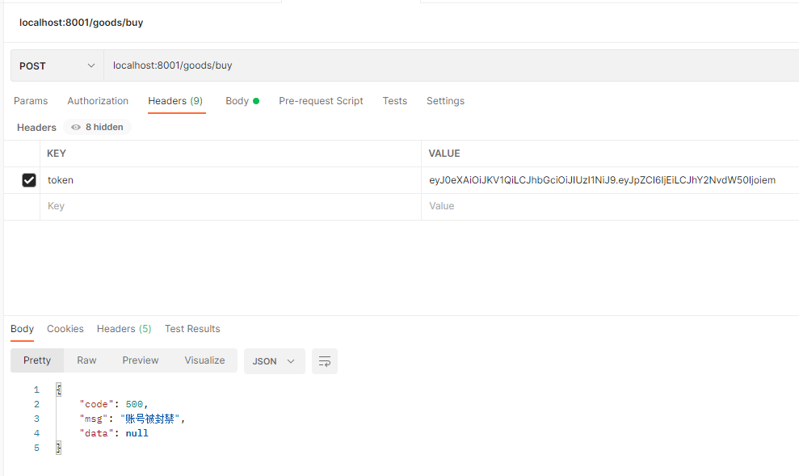

自定义扩展是框架提供给开发者其他业务功能拓展的使用，开发者可以实现自己想要的功能，比如踢人下线，账号封禁等，只要是你想做的，都可以通过自定义扩展实现自己的业务逻辑，实现也是so easy。

这里以账号封禁为例
```
@Component
public class CustomHandler implements ReqFunctionHandler, RepFunctionHandler {

    Map<String,Object> banMap = new ConcurrentHashMap<>(){{
        put("zhangsan",new ConcurrentHashMap<String,Object>(){{
            put("exp", -1);
        }});
    }};

    /**
     * 可以对在请求的过程中 对 request 和 json 内容进行相应的处理
     * @param request
     * @param json
     * @return
     * @throws BasicException
     * @throws IOException
     */
    @Override
    public String exec(HttpServletRequest request, String json) throws BasicException, IOException {
        // 如果在 project-path 描述了此路径,不被拦截 直接返回
        // LocalUtil 是框架自带的本地线程缓存，可以方便获取到 当前登录用户，在controller service 也可以使用
        // 你也可以从自定义缓存如redis中获取，数据库也行
        UserVO user = LocalUtil.<UserVO>getUser();
        Object obj = banMap.get(user.getAccount());
        // 从 obj 取封禁时长等等一系列逻辑都可以写
        if(!ObjectUtil.isNull(obj)){
            throw new BasicException(500,"账号被封禁");
        }
        return json;
    }

    /**
     * 可以对在相应的过程中 对 response 和 json 内容进行相应的处理
     * @param response
     * @param json
     * @return
     * @throws BasicException
     * @throws IOException
     */
    @Override
    public String exec(HttpServletResponse response, String json) throws BasicException, IOException {
        System.out.println("返回拦截，这里看业务实际需要，不需要可以不实现 RepFunctionHandler");
        return json;
    }

    @Override
    public Integer getIndex() {
        return 10;
    }

}
```
请求结果
```
2023-07-14 15:11:00.694 DEBUG 14256 --- [nio-8001-exec-6] c.a.e.s.filter.wrapper.ReqWrapper        : exec handler : com.aizuda.easy.security.handler.exec.BlacklistHandler
2023-07-14 15:11:00.694 DEBUG 14256 --- [nio-8001-exec-6] c.a.e.s.handler.exec.BlacklistHandler    : Accessing the user's IP: 192.168.148.41
2023-07-14 15:11:00.694 DEBUG 14256 --- [nio-8001-exec-6] c.a.e.s.filter.wrapper.ReqWrapper        : exec handler : com.aizuda.easy.security.handler.exec.ProjectPathHandler
2023-07-14 15:11:00.694 DEBUG 14256 --- [nio-8001-exec-6] c.a.e.s.filter.wrapper.ReqWrapper        : exec handler : com.aizuda.easy.security.handler.exec.AuthenticationHandler
2023-07-14 15:11:00.695 DEBUG 14256 --- [nio-8001-exec-6] c.a.e.s.filter.wrapper.ReqWrapper        : exec handler : com.aizuda.easy.security.handler.exec.AuthorizationHandler
2023-07-14 15:11:00.695 DEBUG 14256 --- [nio-8001-exec-6] c.a.e.s.filter.wrapper.ReqWrapper        : exec handler : com.aizuda.easy.security.handler.exec.DecryptPathHandler
2023-07-14 15:11:00.695 DEBUG 14256 --- [nio-8001-exec-6] c.a.e.s.filter.wrapper.ReqWrapper        : exec handler : com.aizuda.easy.security.handler.exec.ReqDataHandler
2023-07-14 15:11:00.695 DEBUG 14256 --- [nio-8001-exec-6] c.a.e.s.filter.wrapper.ReqWrapper        : exec handler : com.fengqianrun.java.controller.CustomHandler
2023-07-14 15:11:00.695 ERROR 14256 --- [nio-8001-exec-6] c.a.easy.security.filter.FunctionFilter  : 账号被封禁
```
测试结果
